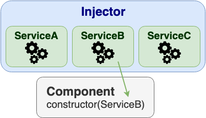
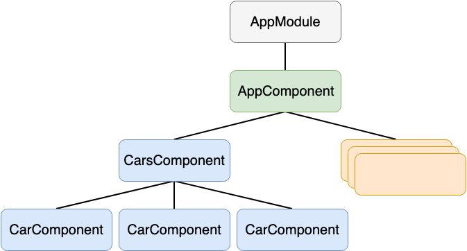
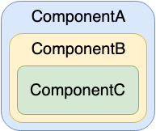

# Angular - Services and Dependency Injection

- Service is a broad category - any value, function, feature, etc.
- Almost anything can be a service
- Dependency Injection provides services, components, etc.
- Angular ships with its own DI framework as standalone module

## Services

- Typically a class with a narrow, well-defined purpose
- There is nothing specifically Angular about services
- Components should delegate tasks to services
- Example is HttpClient from HttpClientModule

Another example is `logger.service.ts`:

```typescript
export class Logger {
  log(msg: any)   { console.log(msg); }
  error(msg: any) { console.error(msg); }
  warn(msg: any)  { console.warn(msg); }
}
```

## Dependency Injection

- Wired into Angular framework and used everywhere
- *Injector* is main mechanism for resolving dependencies
  - Injector maintains a *container* of services
  - Injector can create service from *provider*
- *Provider* is a recipe for creating service



### Using DI

```typescript
@Injectable()
class UserMessagingLogger extends Logger {
  constructor(private userService: UserService) { super(); }

  log(message: string) {
    let name = this.userService.getUser.name;
    super.log(`Message to ${name}: ${message}`);
  }
}
```

#### @Injectable()

- Marks a class available to an *injector*
- Required only when component/service specifies dependency
- Recommended to always add @Injectable() to services
- Supertype of @Component(), @Directive() and @Pipe()

### Testing with DI

```typescript
let expectedLogs = ['Message to Joe: Hello!'];
let mockService = <UserService> {getUser: () => {
    return { name: 'Joe' }
}};

it('should log message with user name', () => {
  let logger = new UserMessagingLogger(mockService);
  logger.log('Hello!');
  expect(logger.logs).toEqual(expectedLogs);
});
```

## Injector

- Maintains *container* of services
- It is itself an injectable service
- Requires registered providers

Automatically configured during bootstrap process in `main.ts`:

```typescript
platformBrowserDynamic().bootstrapModule(AppModule);
```

#### Singletons

- Dependencies are singleton within the scope of injector
- Single service instance is shared among Component and its children

### Using injector explicitly

Creation of injector:

```typescript
const injector = ReflectiveInjector.resolveAndCreate(
    [Car, Engine, Tires]);

let car = injector.get(Car);
```

Working with injector directly:

```typescript
@Component({/* Omitted properties */})
export class InjectorComponent implements OnInit {
  car: Car;
 
  constructor(private injector: Injector) { }
 
  ngOnInit() {
    this.car = this.injector.get(Car);
  }
}
```

## Provider

- Provides concrete, runtime version of dependency value
- Used by injector to create new service
- Can be registered in modules and components

### Registering in module

```typescript
@NgModule({
  imports: [
    BrowserModule
  ],
  declarations: [
    AppComponent
  ],
  providers: [
    Logger
  ],
  bootstrap: [ AppComponent ]
})
export class AppModule { }
```

### Registering in component

```typescript
@Component({
  selector: 'car',
  providers: [CarService],
  template: `
  <h2>Car</h2>
  <engine></engine>
  <tires></tires>
  `
})
export class HeroesComponent { }
```

## Provider object literal

Simplified `providers` array:

```typescript
providers: [Logger]
```

It is shorthand for provider object literal with two properties:

```typescript
providers: [{ provide: Logger, useClass: Logger }]
```

- *provide* is *token* for locating and registering dependency value
- *useClass* is *definition* object that specifies how to create instance of service

### Token

- Key for internal *token-provider* map of injector
- In most cases is class type used as key
- For non-class dependencies exists *InjectionToken*
- Interface cannot be used as it disappears after compilation to pure JavaScript
- Injection of *InjectionToken* requires *@Inject()* decorator

#### Example of InjectionToken usage

```typescript
export interface AppConfig {
  apiEndpoint: string;
  title: string;
}

export const DI_CONFIG: AppConfig = {
  apiEndpoint: 'api.example.com',
  title: 'Dependency Injection'
};
```

```typescript
// FAIL! Can't use interface as provider token
[{ provide: AppConfig, useValue: DI_CONFIG })]
```

```typescript
// FAIL! Can't inject using interface as parameter type
constructor(private config: AppConfig){ }
```

#### Example of InjectionToken usage

```typescript
import { InjectionToken } from '@angular/core';

export const APP_CONFIG
        = new InjectionToken<AppConfig>('app.config');
```

```typescript
providers: [{ provide: APP_CONFIG, useValue: DI_CONFIG }]
```

```typescript
constructor(@Inject(APP_CONFIG) config: AppConfig) {
  this.title = config.title;
}
```

### Class-interface

- Can be used as a token
- Actual implementation doesn't have to implement it but it is recommended
- Usually used as a *narrowing* interface, members of actual implementation are invisible
- It should not have any implementation to minimize memory cost

```typescript
export abstract class MinimalLogger {
  logs: string[];
  logInfo: (msg: string) => void;
}
```

### Provider definitions

- Class
- Alternative class
- Alias - use existing service
- Value - primitive type, object, function, etc.
- Factory - function

```typescript
providers: [
  Engine, // { provide: Engine, useClass: Engine }
  { provide: Logger, useClass: UserMessagingLogger },
  { provide: MinimalLogger, useExisting: Logger },
  { provide: TITLE, useValue: 'Dependency Injection' },
  { provide: Car, useFactory: carFactory, deps: [Engine] }
]
```

```typescript
export const carFactory = (engine: Engine) => {
    return new Car(engine);
}
```

## Hierarchical Injectors

- Angular application is a tree of components
- Each component has its own injector
- Injector bubbling - from self to parent until found or error
- Re-providing services - first provider encountered wins



### Limit service scope (isolation)

- Recommendation is to register providers directly to components which use it
- Reducing risk of using services for different purpose that was designed
- Example is admin section with api service for maintaining secured area

### Multiple service instances (sandboxing)

- Allows to handle work on several tasks at the same time
- Services are singletons in injector scope
- Components would override one state without sandboxing

### Specialized providers



ComponentA providers: `[CarService, EngineService, TiresService]`
ComponentB providers: `[CarService2, EngineService2]`
ComponentC providers: `[CarService3]`

Resolved dependencies of ComponentC:


## Qualifying dependency lookup

- `@Optional()` decorator sets injection parameter to null if not found
- `@Host()` decorator stops upward search at the *host* component

```typescript
@Component({/* Omitted properties */})
export class CarComponent {
 
  hasTires = false;
 
  constructor(
      @Host()     // limit search for tires
      @Optional() // ok if tires don't exist
      private tiresService: TiresService
  ) {
    if (tiresService) {
      this.hasTires = true;
    }
  }
}
```

## Inject DOM element

```typescript
import { Directive, ElementRef, HostListener }
        from '@angular/core';
 
@Directive({ selector: '[myHighlight]' })
export class HighlightDirective {
 
  private el: HTMLElement;
 
  constructor(el: ElementRef) {
    this.el = el.nativeElement;
  }
 
  @HostListener('mouseenter') onMouseEnter() {
    this.el.style.backgroundColor = 'yellow';
  }
 
  @HostListener('mouseleave') onMouseLeave() {
    this.el.style.backgroundColor = null;
  }
}
```

## Derived classes injection

- Dependencies must be re-provided and re-injected

```typescript
@Component({
  /* Omitted properties */
  providers: [EngineService]
})
export class CarComponent {
  constructor(private engineService: EngineService) { }
}
```

```typescript
@Component({
  /* Omitted properties */
  providers: [EngineService]
})
export class RacingCarComponent extends CarComponent {
  constructor(engineService: EngineService) {
    super(engineService);
  }
}
```

## Inject parent component

- Parent can be found by:
  - Its class
  - Class-interface
- Parent CANNOT be found:
  - By base class (extends)

### Examples of parent injection

In child component if parent is of known type:

```typescript
export class ChildComponent {
  constructor( private parent: ParentComponent ) { }
}
```

### Examples of parent injection by class-interface

In parent component:

```typescript
providers: [{
  provide: Parent,
  useExisting: forwardRef(() => ParentComponent)
}]
```

In child component:

```typescript
export class ChildComponent {
  constructor( private parent: Parent ) { }
}
```

### Examples of parent injection

In child component which is also parent:

```typescript
@Component({
  /* Omitted properties */
  providers: [{
    provide: Parent,
    useExisting: forwardRef(() => ChildAndParentComponent)
  }]
})
export class ChildAndParentComponent {
  constructor( @SkipSelf() private parent: Parent ) { }
}
```

## Circular dependencies

- Order of declaration matters in TypeScript
- It is impossible to refer to a class until it has been defined
- Resolved with *forwardRef()* which creates indirect reference that can be resolved later

## Provider helpers

- Removes code duplication

```typescript
providers: [{
  provide: Parent,
  useExisting: forwardRef(() => ParentComponent)
}]
```

With helper:

```typescript
const provideParent =
  (component: any) => {
    return {
        provide: Parent,
        useExisting: forwardRef(() => component)
    };
  };
```

```typescript
providers:  [ provideParent(ParentComponent) ]
```
