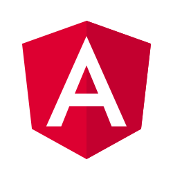

# Angular

### Introduction and hands on

## Prerequisites

- Install Node.js: https://nodejs.org/ (version 8.x or 10.x)
  - Or make sure your Node.js version is 8.x or 10.x (e.g. by `node -v` command)
    and npm is at least 5.x (e.g. by `npm -v` command).
    For Node.js update just download and install new version,for npm update
    follow instruction on https://docs.npmjs.com/try-the-latest-stable-version-of-npm
- Install Visual Studio Code: https://code.visualstudio.com/
  - Inside VS Code install extensions:
    - Angular Language Service (by Angular)
    - Angular Files (by Alexander Ivanichev)
    - Angular v7 Snippets (by John Papa)
    - TSLint (by egamma)
- Install Git (optional but recommended): https://git-scm.com/ (Angular can perform initial commit when Git is installed)
- Install Angular CLI: in any shell or command-line interpreter (e.g. cmd.exe) run: `npm install --global @angular/cli`
  - In older versions of windows use quotes: `npm install --global "@angular/cli"`
  - Or make sure your Angular CLI version is at least 7.1.x (e.g. by `ng v` command).
    For update run: `npm update --global @angular/cli`.

## Angular framework

- Angular != AngularJS
- JavaScript platform for web applications
- It provides robust capabilities
  - Also support server side rendering
- It is written in Typescript
- Large community of developers
- Rapid development cycle
  - Minor releases should not break API
- Developed by Google
  - Trustworthy for enterprise

## Architecture Overview

## Lectures

1. Project Setup
2. Components
3. Data Binding
4. Events
5. Forms
6. Directives
7. Pipes
8. Services and Service Providers
9. Modules
10. Routing
